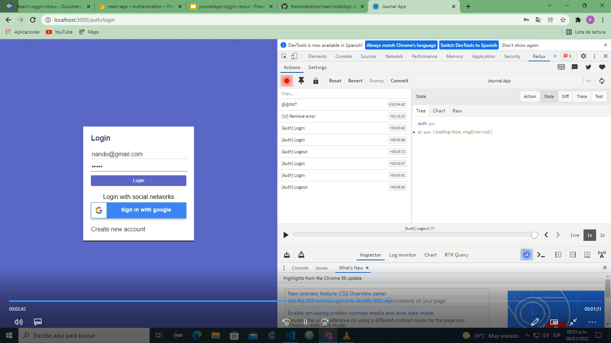

La intencion de este proyecto es poder documentar los conceptos necesarios para implementar
un loggin con el uso de redux, el estudio se basa en una app de un curso de udemmy

[Documentacion de la App](doc/React-Loggin-redux.pdf)

